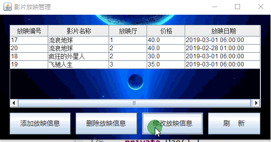
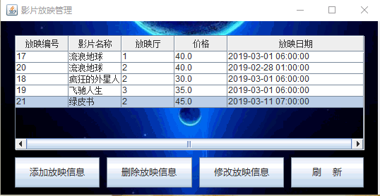
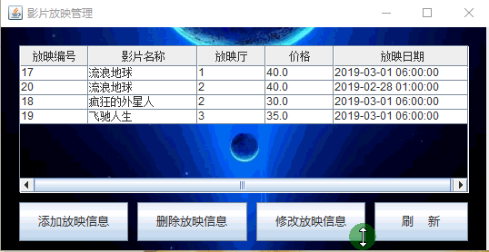

# MoiveTicketManageSys
开发环境：Eclipse附带windowsbuilder插件；

使用数据库：MySQL8.0；创建数据库的脚本文件：createDatabase.sql；

系统简介：本系统是作为电影院前台使用的订电影票的系统，使用场景为影院管理员添加电影信息、添加放映信息等，顾客到电影院现场询问电影场次、选择座位、并预定电影票；

系统用户：电影院管理员、电影院前台售票员；

效果演示：

管理员添加放映信息：

管理员删除放映信息：

管理员修改放映信息：

开发小记：本系统是作为数据库课程设计的一项作业，在做本作业的时候，时间仓促，许多细节地方做得不够完善，只是简单实现了一个操作起来复杂且不方便的系统。作为练习，我重新从零开始做一遍整个系统，截止2019/2/13，只完成了管理员的大部分功能（添加电影信息、添加放映信息、售票员管理），订票功能会在以后实现，不定期更新。加油！；

2019/2/18更新：完成售票员的部分功能：电影信息查询、放映信息查询、账户密码修改。售票功能正在实现中，需要克服的技术难点在于：能方便地进行场次和座位选择，能可视化已经被预定的座位；

2019/2/20更新：完成售票员预订电影票、退订电影票功能；

2019/2/26更新：修复一些小BUG，上传了数据库创建的sql脚本。

2019/3/8更新：夜晚突然想整理一下整个项目的思路。

首先是电影院管理员，主要任务是能管理电影信息，管理放映信息和管理售票员。

管理电影信息包括了增删改查电影信息，管理放映信息包括了增删改查信息，这里需要注意的是增加放映信息需要对应增加一张对应放映厅的数据表，我们或许通过这张数据表来进行后续的数据分析？

然后是售票员，主要包括查询电影信息，查询放映信息，根据放映信息订票/退票，修改用户密码。

附：
电影院前台订票系统使用方法：

1.配置要求：

     1.1 Java环境：JDK、JRE；（自行百度安装即可）
     
     1.2 数据库环境：MySQL8.0；（自行百度安装即可）
     
           运行本项目，需要修改package dao里面的Dao.java文件，修改变量dbUser和dbPwd为自己的MySQL用户名和密码。
           
2.完成配置要求后，通过命令行登录MySQL，找到createDatabase.sql文件对于的目录，执行source createDatabase.sql，创建系统运行所需数据库。

3.使用eclipse或Intellij IDEA运行本项目的selectFrame.java文件。
